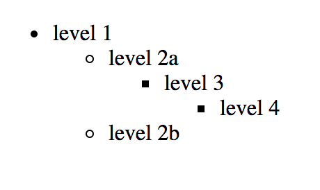
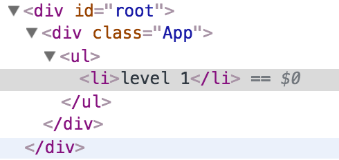
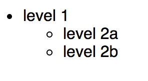

# Recursive rendering and event bubbling

I have been working with dense tree structures recently, and rendering them using React. Trees lend themselves well to recursion, so I set about making a component that could render itself and all subsequent children with ease. I thought I was being mightily clever, until I tried to add some behaviour to my recursive component. Things were not behaving as they should, and I was stumped for quite some time. When I finally stepped back from the trees to see the forest (pun intended), I had to step all the way back to HTML-101 to find the answer.

Here is my clever component:

```javascript
export default class ListItem extends PureComponent {
  renderChildren = arr => {
    return <ul>{arr.map(this.renderChild)}</ul>;
  };

  renderChild = item => <ListItem {...item} />;

  render() {
    const { name, children } = this.props;

    return (
      <li>
        {name}
        {children && this.renderChildren(children)}
      </li>
    );
  }
}
```

When called from the parent container with the root of the tree, this component will render all nodes of the tree as unordered lists of items:



Of course, with very deep trees, it is useful to clear away visual noise by collapsing parts of the tree, so I added an `onClick` handler to each list item with children:

```javascript
export default class ListItem extends PureComponent {
  state = {
    showChildren: true
  };

  onClick = e => {
    this.setState({ showChildren: !this.state.showChildren });
  };

...

  render() {
    const { name, children } = this.props;
    const { showChildren } = this.state;

    return (
      <li onClick={this.onClick}>
        {name}
        {children && showChildren && this.renderChildren(children)}
      </li>
    );
  }
}
```

Setting state on the ListItem instance is a clever way to hide parts of the list by not rendering them, rather than resorting to conditional CSS. You can imagine my chagrin, then, when I clicked on an item, and the entire tree collapsed into the root:



I spent a long time investigating if the state was leaking from one instance of ListItem to another, until I finally turned my suspicions on the click handler.

I went back to [the primer](https://developer.mozilla.org/en-US/docs/Learn/JavaScript/Building_blocks/Events) on how the DOM handles events, and found the answer to my overzealous-click problem:

> The browser checks to see if the element's outer-most ancestor (<html>) has an onclick event handler registered on it in the capturing phase, and runs it if so.

This list-collapsing problem wasn't ocurring because of using recursion, it was happening because of event bubbling (:face-palm:).

> [When a user clicks on a ListItem, t]he browser checks to see if the element that was actually clicked on has an onclick event handler registered on it in the bubbling phase, and runs it if so.

> **Then it moves on to the next immediate ancestor element and does the same thing**, then the next one, and so on until it reaches the <html> element.

Because there was a click handler registered on every list item, a click on any one of them would be handled by **every one of them**.
Fortunately, Javascript-Events-101 also prescribes a solution: `e.stopPropagation()`, which stops the event from bubbling up the ancestry tree.

My final `onClick` handler:

```javascript
onClick = e => {
  e.stopPropagation();

  const { showChildren } = this.state;
  this.setState({ showChildren: !showChildren });
};
```

And the nested result I wanted:


